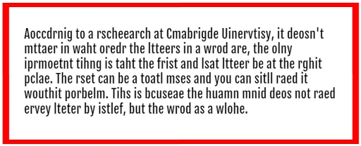

This article presents a Java implementation of a "legible word scrambler" and
contrasts it with an equivalent Kotlin implementation that showcases Kotlin's
strengths. The reader is expected to be proficient with Java.



## What's in a Word?

A word is a sequence of letters (duh!). A letter is an alphabetic character
coming in various flavors:

- lowercase
- UPPERCASE
- Àcçëntúãtêd

A _legible scrambled word_ is a modified word where

- The first and last letters are left undisturbed
- The inner letters are shuffled so most or all of them change their positions

We'll be inmepltmneig a leglibe wrod sramecblr tcwie (oh, yaeh!). Frsit in Jvaa,
for the reaedr to conecnt and tehn in Koitln for the radeer to be enlgtnieehd.


### More on Scrambled Words

A legible scrambled word must retain its first and last letters and randomly
shuffle its inner letters at will...

... but restrictions apply:

- It must be at least four letters in length for scrambling to make sense
- Inner letters must contain at least two _distinct_ letters

To ascertain the four-letter rule, consider the following words:

|Word|Comment                                   |
|----|------------------------------------------|
|I   |No inner letters to speak of              |
|We  |No inner letters to speak of              |
|You |Only one inner letter; can't shuffle      |
|They|Four letters; now we can shuffle! (_Tehy_)|

Having four or more letters is not enough, though. Consider now the following
words:

- `Good`
- `Seed`
- `Coool` (_teen spelling_)

Note how, despite their being four letters or more in length, the inner letters
are all the same. Such words would all scramble to themselves and are not to
be processed.

### The Art of Shuffling

Shuffling relies on a randomizer. However, and especially for  short words, a
randomizer may occasionally yield the same, original inner letter ordering.
This can be quite annoying for our goal. Thus, shuffling must be repeated
until a different inner letter order is produced

> Baetnigs wlil cntinoue utinl morael imporevs

For long words, on the other hand, too much shuffling may cause the
scrambled word to become unreadable.

A [string similarity](https://en.wikipedia.org/wiki/String_metric) metric
measures how similar two strings are. Similarity scores oscillate between 0.0
(unrelated) and 1.0 (identical). Applying the normalized [Levenshtein](https://en.wikipedia.org/wiki/Levenshtein_distance)
similarity metric to the word _unmistakable_ and a few of its scrambled
forms we get:

|Similarity|Legibility|Shufflings              |
|:--------:|:--------:|:----------------------:|
|0.83      |😃        |Unmistabkale Unlmistakabe Unmstakaible|
|0.50      |😐        |Utamislkabne Uniasbamktle Unmbtlaikase|
|0.25      |😔        |Uaknlibsmtae Usialbntamke Usinabmlatke|
|0.16      |😖        |Uaaltmbnksie Utambkilnsae Ualmakbnitse|

An interesting  improvement could be to keep shuffling until we find a
scrambled form that has a Levenshtein similarity of at least 0.75 with its
source word. For the sake of simplicity we won't implement any such
refinements here.

### Scrambling Words within Free-form Text

Scrambling words within text requires scrambling only words while leaving
all other, non-alphabetic content (whitespace, punctuation) unchanged.

Consider the following quote and its scrambled form:

🄸'🄼 🅃🅆🄾 🅆🄸🅃🄷 🄽🄰🅃🅄🅁🄴 ― 🅆🄾🄾🄳🅈 🄰🄻🄻🄴🄽

🄸'🄼 🅃🅆🄾 🅆🅃🄸🄷 🄽🄰🅃🅁🅄🄴 ― 🅆🄾🄳🄾🅈 🄰🄴🄻🄻🄽

Note that nothing changes length and (except for inner letters, of course)
nothing else changes position either.

We can clone the original text into a character array and operate on this
copy overwriting only the inner letter word regions with their scrambled
incarnations.

All we need is the starting and ending position of each word; neat!

## First in Java...

Armed with this knowledge, our complete Java implementation is shown below
in all its shining glory:

```java
public class WordScrambler {

  // 4+ latin letters, 2+ distinct inners
  private static final Pattern WORD_REGEX = 
    Pattern.compile("\\p{IsLatin}(\\p{IsLatin})\\1*(?!\\1)\\p{IsLatin}\\p{IsLatin}+");

  // Scramble words within text
  public static String 
    scrambleWords(String text) {

    // Copy input text to output array
    final var result = 
            text.toCharArray();

    // Create randomizer for this run
    final var random = new Random();

    // Examine text looking for matches
    WORD_REGEX.matcher(text).results()
      .forEach(match -> {
        // 2nd letter
        final var start = 
          match.start() + 1;
        // Penultimate letter
        final var end = match.end() - 1;
        final var length = end - start;
  
        do {
          // Shuffle inner letter array
          for (var i = start;i < end;i++){
            // Choose random inner index
            final var rndIdx = start + 
              random.nextInt(length);
            // Swap current and random chars
            final var save = 
              result[rndIdx];
            result[rndIdx] = result[i];
            result[i] = save;
          }
          // Ensure shuffling took place!
        } while (
            IntStream.range(start, end)
              .allMatch(i ->
                result[i] == 
                  text.charAt(i))
          ); // do/while
      }); // forEach

    // Return scrambled text as string
    return new String(result);
  }
}
```

For the trained Java eye, the above code should be self-explanatory
(or so one can hope 😉)

We offer plenty of dispelling commentary below so read on!

## ...Then in Kotlin

Having shown the Java implementation, the Kotlin one can now be
presented in all its dazzling splendor:

```kotlin
package wscrambler

import java.io.File

// 4+ latin letters, 2+ distinct inners
private val WORD_REGEX =
  """\p{IsLatin}(\p{IsLatin})\1*(?!\1)\p{IsLatin}\p{IsLatin}+"""
    .toRegex()

// Scramble words within text
fun scrambleWords(text: String): String {

  // Copy input text to output array
  val result = text.toCharArray()

  // Examine text looking for matches
  WORD_REGEX.findAll(text).forEach { match->
      // Define range of inner letters
      val range = match.range.first + 1
        until match.range.last
      do {
        // Shuffle inner letter array
        for (i in range) {
          // Choose random region index
          val rndIdx = range.random()
         // Swap current/random chars
          result[rndIdx] = result[i].also{
              result[i] =  result[rndIdx]
          }
        }
          // Ensure shuffling took place!
      } while (range.all { 
          result[it] == text[it] 
        })
    }

  // Return scrambled text as string
  return String(result)
}
```


Again, to the trained Java eye, the above code should be readily
understandable. Anything obscure in either implementation should
hopefully be clarified by the explanations below.

### Kotlin is Familiar

Yes, seasoned Java developers have little difficulty parsing the above
Kotlin code even if a few constructs don't have obvious Java counterparts.

This is by design: Kotlin was designed to depart as little as possible from
established Java syntax. This is also true of API's: JVM Kotlin builds upon
familiar Java API's while  retaining compatibility and enriching them in
intuitive ways.

Thus, when we say:

```kotlin
val reader = File(filename).reader()
```

we're actually saying:

```kotlin
var reader: java.io.InputStreamReader = 
 /*new*/ java.io.File(filename).reader() 
```

which is Kotlinese for Java's:

```java
final var reader = 
  new InputStreamReader(
    new FileInputStream(filename));
```

### Kotlin is Compact

Our complete, commented Java implementation is 84 lines while the Kotlin one
is a mere 54.

Unlike some other languages, such brevity is _not_ achieved at the expense of
readability; quite the contrary. It could be argued that, to the casual reader,
the Kotlin version is probably easier to follow than the Java one. Again, this
is by design.

For example, Java lambdas allow for concise, crisp code; often one-liners.
However, things can get complicated as show below.

Compare the following Kotlin code (stolen from our scrambler's `main` method):

```kotlin
// Collect file readers from args/stdin
val readers =
  if (args.isNotEmpty()) 
    args.map { File(it).reader() }
  else 
    listOf(System.`in`.reader())

// Swallow all readers into single string
val content = readers.joinToString("\n") { 
  it.readText() 
}
```

and its Java counterpart:

```java
// Collect file readers from args (or stdin)
final Stream<BufferedReader> readers;
if (args.length > 0) {
  readers = Arrays.stream(args)
    .map(filename -> {
      try {
        return new BufferedReader(
          new FileReader(filename));
      } catch (Exception e) {
        // No lambda checked exceptions
        throw new RuntimeException(e);
      }
    });
} else {
  readers = Stream.of(
    new BufferedReader(
     new InputStreamReader(System.in)));
}
// Swallow all readers into single string
final var content = readers
  .flatMap(BufferedReader::lines)
  .collect(Collectors.joining("\n"));
```

Here, Kotlin is much more concise (and readable) because:

- Arrays have high-level methods such as `isNotEmpty()`
- `If/Else` is an expression, not a statement. Thus, it can be used in
  assignments
- _Extension functions_ (like `File.reader()` and `reader.readText()`)
  enrich existing classes with handy, macro-like functionality
  (more on this below)
- All exceptions are treated as unchecked
- Common lambda patterns, like joining results in a `String`, are idiomatic

### (Far) Fewer Imports!

When presenting the full Java implementation above we omitted imports for
brevity. We didn't have to do this with the Kotlin version: there's only one
import (`import java.io.File`.)

The reason is that while Java's _prelude_ (the set of classes that can be
used without importing) is limited to package `java.lang`, Kotlin's prelude
includes a carefully selected set of additional packages that covers a lot
of the most commonly used classes (I/O, ranges, collections, text, etc.)

Our Java implementation, on the other hand, we require 9 imports that can
be abbreviated, at most, to:

```java
import java.io.*;
import java.util.*;
import java.util.regex.*;
import java.util.stream.*;
```

### Kotlin Extension Functions

Where in Java we say:

```java
final var wordRegex = 
  Pattern.compile("\\p{InLatin}{4,}")
```

in Kotlin, we say:

```kotlin
val wordRegex =
  """\p{InLatin}{4,}""".toRegex()
```

This looks as if `String` possessed a `toRegex()` method to convert it to a
regular expression (which, of course, it doesn't.)

This is an instance of _extension function_: a function that can be attributed
to an existing class even if we don't have access to that class' source code
or, as is the case with `String`, even if it's a system, final class!

If we wanted to implement the `toRegex()` extension ourselves we'd say:

```kotlin
fun String.toRegex(): Regex {
    return Regex(Pattern.compile(this))
}
```

Here:

- The name of target class to be "extended" is prepended to the function name
- Inside the function, `this` refers to the target instance of the "extended"
  class
- The function's return type is specified by the trailing `: Regex`. In Kotlin
  types are specified _after_ variable names.

## More on Crispness

When a function is a simple one-liner we can define it with an equals sign and
do without the curly braces and the `return` statement. We can also omit the
function's return type if it's patently obvious. The above `String.toRegex()`
function is better spelled as:

```kotlin
fun String.toRegex() = 
  Regex(Pattern.compile(this))
```

Note also that, in Kotlin, when using triple quotes around strings, we don't
need to escape the contents. Thus, while in Java we _have to_ escape:

```java
"""\\p{InLatin}{4,}"""
```

in Kotlin, we don't:

```kotlin
"""\p{InLatin}{4,}""""""
```

👉 BTW, Java's regex character class`\p{IsLatin}` is shorthand for
`[a-zA-ZÀ-ÿ]`, where the Unicode range `[À-ÿ]` contains (only) the
accented Latin letters, both upper and lowercase

### ... But We're Not Using `\p{InLatin}{4,}`!

Yes, if we just needed to match four or more latin letters then
`\p{IsLatin}{4,}` would suffice.

But when we want to ensure the inner letters contain at least
2 distinct characters then Dr. Jekyll becomes Mr. Hyde:

```regexp
\p{IsLatin}(\p{IsLatin})\1*(?!\1)\p{IsLatin}\p{IsLatin}+
```

Ouch! 😀

This regular expression is composed of the following five parts:

1. `\p{IsLatin}`: we require the first character to be a latin letter
2. `(\p{IsLatin})`: we require the second character to be a latin letter as
   well but this time we enclose the class in parentheses. This enables us to
   refer to this second letter (as `\1`) later in the same regular expression
3. `\1*`: we allow for the third character (and any subsequent characters)
   to be
   repetitions of the second letter. The second letter is referenced as `\1`
   and the operator `*` allows it to be repeated zero or more times
4. `(?!\1)\p{IsLatin}`: the nub of our regex. We require a latin letter
   such that it is _not_ equal to the second letter (`(?!\1)`). This is a
   _back reference negation_
5. `\p{IsLatin}+`: after the previous, non-equal-to-the-second letter we
   allow for one or more (`+`) trailing letters

Thus, this regular expression:

|matches...|but not...|because...             |
|:---------|---------:|:---------------------:|
|Kotlin    |C         |Just 1 letter          |
|Gödel     |in        |Just 2 letters         |
|neato     |Zöe       |Just 3 letters         |
|compsci   |cool      |All inner letters equal|


### Kotlin Ranges: Less Looping, More Power

Where, in our `scrambleWords(String)` Java method, we wrote:

```java
// Examine text looking for matches
WORD_REGEX.matcher(text).results()
  .forEach(match -> {
    // Second letter
    final var start = match.start() + 1;
    // Penultimate letter
    final var end = match.end() - 1;
    final var length = end - start;
    // ... shuffling stuff ...
  }
```

In Kotlin we write:

```kotlin
// Examine text looking for matches
WORD_REGEX.findAll(text)
  .forEach { match ->
    // Define range of inner letters
    val range = 
      match.range.first + 1 
        until match.range.last
    // ... shuffling stuff ...
  }
```

In Kotlin, ranges are first-class citizens: we can iterate over them and
treat them as lambda targets (map, filter, fold, etc.)

Thanks to Kotlin ranges the following Java code:

```java
// Shuffle inner letter array
for (var i = start; i < end; i++) {
  // Choose a random index in region
  final var rndIdx = 
    start + random.nextInt(length);
  // Swap current and random chars
  final var save = result[rndIdx];
  result[rndIdx] = result[i];
  result[i] = save;
}
```

becomes:

```kotlin
// Shuffle inner letter array
for (i in range) {
  // Choose a random index in region
  val rndIdx: Int = range.random()
  // Swap current and random chars
  result[rndIdx] = result[i].also {
    result[i] = result[rndIdx]
  }
}
```

Interestingly, ranges have their own `random()` extension function that can
be invoked without providing a randomizer. That's why our Kotlin 
implementation doesn't have  a `Random` instance like the Java one does.

Note also how we exploit the `also` extension function to simplify swapping.
It may look "overly idiomatic," but it allows for some showing off... 😏


### Boolean Lambda Expressions

The above shuffling loop is enclosed in a `do/while` loop in both
implementations:

```java
// Java
do {
  // ... shuffling stuff...
  // Ensure shuffling took place!
  } while((IntStream.range(start, end)
      .allMatch(i ->
        result[i] == text.charAt(i)
  });
```

The multi-line `do/while` bit above might look a bit weird to some, but bear
in mind the lambda condition is actually a boolean _expression_, not a
statement!

The predicate passed to the `allMatch` method requires that, for all indices
in the range, the corresponding character in the result array coincides with
the corresponding character in the input string.

Whenever all characters in the inner letter region are the same in the
shuffled array and in the input string we have a false scrambling, and we must
re-shuffle.

The corresponding Kotlin code is arguably simpler and more readable despite
being based, too, on a boolean lambda expression:

```kotlin
do {
  // ... shuffling stuff...
  // Ensure shuffling took place!
} while (range.all { 
    result[it] == text[it] })
```

Here `it` is the implicit named assigned to the lambda parameter when one
is not explicitly declared.

Note how both arrays (`result`) and strings (`text`) are uniformly
indexed with the `[]` operator. This is also true of collections such as `List`
and `Map`!

### The `main` Function

A naked `main` function is executable from the command line. Thus, if we have:

```kotlin
// File: Echo.kt
package example

fun main(args: Array<String>) {
  println(args.joinToString(" "))
}
```

We can execute it with:

```bash
$ kotlin example.EchoKt Testing one two three
Testing one two three
```

Note `main`'s (synthesized) fully-qualified class name is formed concatenating:
- The package name
- The file name, and
- The "`Kt`" suffix

Note also the type `Array<String>`. Kotlin arrays are regular generic types,
just like collections! They're indexed with `[]`, as in Java, and are as
efficient as their Java counterparts because, despite appearances, they 
_are_ Java arrays.

```kotlin
val words = arrayOf(
    "out", "of", "mind", 
    "back", "in", "five")
println(words[2]) // prints "mind"
```

If a `main` function requires arguments they can be omitted, and the function
is still executable:

```kotlin
fun main() = println("Greetings Earth!")
```

For illustration purposes here is the complete Kolin implementation of the
`main` for our legible word scrambler:

```kotlin
// Scramble words from files/stdin to stdout
fun main(args: Array<String>) {

  // Collect file readers from args/stdin
  val readers =
    if (args.isNotEmpty()) 
      args.map { File(it).reader() }
    else
      // in: quoted because reserved
      listOf(System.`in`.reader())

  // Swallow all readers into string
  val content = 
      readers.joinToString("\n") {
        // Reads entire file    
        it.readText()
      }

  // Scramble words and print to stdout
  println(scrambleWords(content))
}
```

### Packages Can Have Members

The astute reader may have noticed that, unlike in Java, in Kotlin our
`scrambleWords()` and `main()` functions are not contained in a class. This
is also true of the `WORD_REGEX` value.

👉 A note on terminology: Kotlin uniformly calls executable units _functions_,
rather than _methods_. For a function to be deemed a method it must be
contained in an object or a class; it must have a _target_. 

Functions `scrambleWords` and `main`, as well as value `WORD_REGEX`, belong to
their enclosing `wscrambler` _package_ and are referred to like thus:

```kotlin
wscrambler.scrambleWords("I come in peace")
```

Also noticeable is that package value `WORD_REGEX` is `private` and, thus,
visible only inside the `wscrambler` package.

```kotlin
package wscrambler

// 4+ latin letters, 2+ distinct inners
private val WORD_REGEX =
  """\p{IsLatin}(\p{IsLatin})\1*(?!\1)\p{IsLatin}\p{IsLatin}+"""
      .toRegex()
```

So, in Kotlin, a package can directly contain values, variables,
functions, objects, classes, annotations; the entire zoo.

Executable statements are _not_ allowed inside packages, though. They can
only appear inside functions.

### Whaddaya Mean "Objects"?

We've mentioned "objects" twice above. What on Earth is a Kotlin _object_?

A Kotlin object is a singleton instance that may (or may not) extend a class,
implement interfaces and have internal members.

In our example (and for the sake of simplicity) the `WORD_REGEX` value and
the `scrambleWords` function belong directly to their enclosing package
`wscrambler`.

This is something a purist may frown upon as value `WORD_REGEX` should be
actually private to function `scrambleWords` (but not wastefully rebuilt on
every invocation!)

One sensible way to organize things would be:

```kotlin
package wscrambler

object WordScrambler {
  // Regex compiled only once:
  // at object initialization.
  // Inaccessible to others,
  // even in the same package.
  private val WORD_REGEX =
    """\p{IsLatin}(\p{IsLatin})\1*(?!\1)\p{IsLatin}\p{IsLatin}+"""
        .toRegex()
    
  fun scrambleWords(text: String):String {
    // scrambling logic goes here...
  }
}

// more package stuff ...

fun main() {
  // Function called w/qualified name
  println(WordScrambler.scrambleWords(
   "I'm two with nature -- Woody Allen"))
}
```

Kotlin classes can have associated _companion objects_ holding what in Javaland
we'd call static members. A companion object, however, is much more than a
container for static stuff: it doesn't (have to) extend its associated class,
it may implement interfaces and it may have its own members.

Stretching out our example we could conceive of an (admittedly smelly)
"ultra-generic" implementation like:

```kotlin
package scrambler;

class Scrambler(private val regex:Regex) {
  companion object {
    private val WORD_REGEX =
      """\p{IsLatin}(\p{IsLatin})\1*(?!\1)\p{IsLatin}\p{IsLatin}+"""
          .toRegex()
    fun scramble(text: String) = 
      scramble(WORD_REGEX)
    fun scramble(text: String, 
                 regex: Regex) {
          // Regex-agnostic code here...
      }
  }
  // Instance delegates to companion
  fun scramble(text: String) = 
    Scrambler.scramble(regex)
}
```

Kotlin doesn't support the notion of static members as Java does (it
doesn't need them.) It does, however, transparently play nice with Java's
static members and where they are _required_ annotations can be used to
specify them.

```kotlin
package wscrambler

class Scrambler(private val regex:Regex){
    companion object {
        private val WORD_REGEX =
            """\p{IsLatin}(\p{IsLatin})\1*(?!\1)\p{IsLatin}\p{IsLatin}+""".toRegex()

        @JvmStatic // A static method
        // FQN: wscrambler.Scrambler
        fun main(args: Array<String>) {
          println(scramble(
            args.joinToString(" "), 
            WORD_REGEX))
        }
        fun scramble(text: String, 
                     regex: Regex) {
          // Regex-agnostic code here...
        }
    }

    fun scramble(text: String) = 
      Scrambler.scramble(text, regex)
}
```

👉 Also: classes and functions are public by default (which reduces verbosity.)
Classes, however, are _closed_ (`final`) by default which discourages
"unintended" inheritance abuse.

## Conclusion

Uff, a rather long ride! For those of you who made it here: kudos! You're on
your way to become a fulfilled Kotlin developer.

Kotlin has gained traction in the Android world, thanks in no small part to
Google's endorsement of it as their preferred Android language. Kotlin has 
also gained lots of traction in the backend as well with Spring openly 
supporting its use.

Beyond the JVM, Kotlin also [compiles to native binaries](https://kotlinlang.org/docs/reference/native-overview.html)
(via [LLVM](https://llvm.org/)) as well as [to Javascript](https://kotlinlang.org/docs/reference/js-overview.html).

What's not to love?
